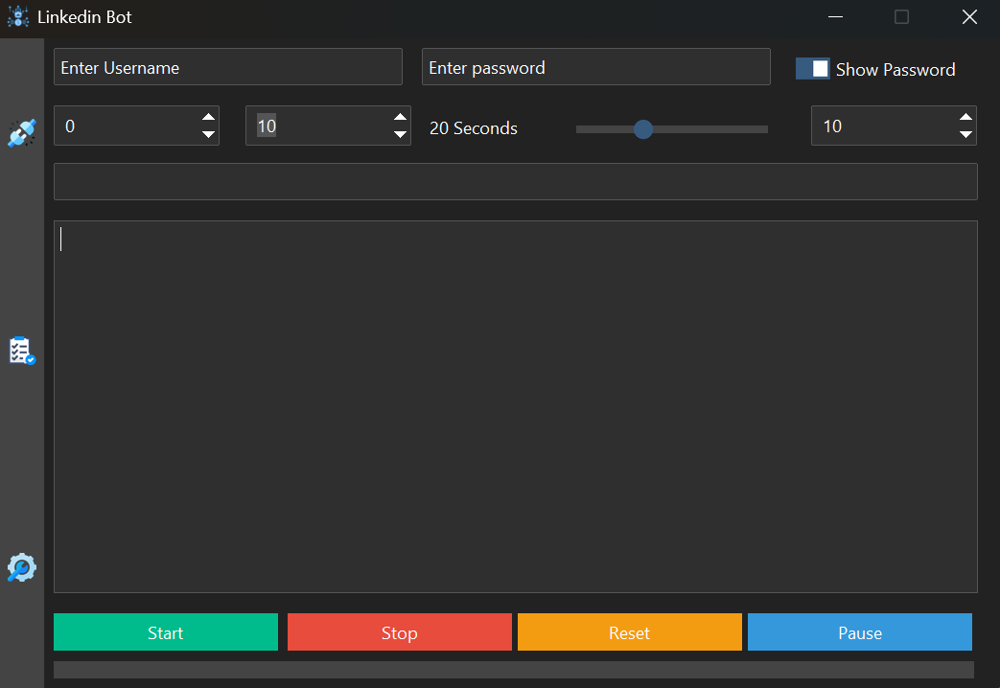

# 🤖 Linkedin Automation Bot 🌐

  


  

## 🚀 About the Project

This **LinkedIn Bot** is a powerful yet simple-to-use desktop application built with `Tkinter`, `Selenium`, and `BeautifulSoup` to automate your LinkedIn activities efficiently. 🌟  

  

🎯 **Key Features:**

- 🔍 Search for LinkedIn profiles based on specific **keywords**.  

- 🤝 Automatically send **connection requests** to targeted profiles.  

- ✉️ Send **personalized messages** to new connections.  

- 💡 Intuitive and user-friendly GUI for seamless control.

  

---

  

## 📋 How It Works

1. **Keyword Input:** Enter the desired keywords for your target audience (e.g., "Data Scientist," "Software Engineer").  

2. **Automated Connections:** The bot automatically scans LinkedIn and sends connection requests to profiles that match your criteria.  

3. **Custom Messages:** Add a personal touch by customizing the connection request message to make it unique.  

4. **Execution:** The bot uses Selenium for browser automation and BeautifulSoup for parsing LinkedIn data.  

  

---

  

## 🛠️ Technologies Used

- **Tkinter**: For creating a graphical user interface.  

- **Selenium**: For automating browser actions.  

- **BeautifulSoup**: For parsing and scraping LinkedIn data.  

- **Python**: The core language powering the bot.  

  

---

## ⚙️ Installation and Setup


  

```bash
git clone https://github.com/vinaypant33/linkedin_bot.git
```

```bash
pip install -r requirements.txt
```

### Run the bot:

  
  
```python
main_script.py
```
  

Launch the GUI, input your LinkedIn credentials, and start automating! 🎉
  

⚠️ Disclaimer

This bot is designed for educational purposes only. Use it responsibly and adhere to LinkedIn's Terms of Service. 🚨

Overuse or misuse of this bot may lead to account restrictions.

  

🖼️ Screenshots

  



  
  

🧑‍💻 Contributing

Contributions are welcome! Open an issue or submit a pull request to improve the bot.

  

⭐ Support

If you find this project helpful, please give it a star ⭐ on GitHub. Your support motivates me to build more awesome projects!

  

📧 Contact

For feedback or questions, reach out at: your.email@example.com

  

Happy automating! 🤖✨
